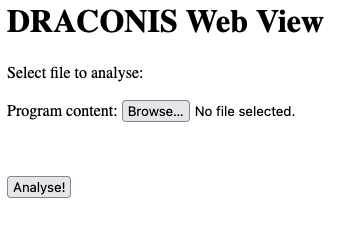
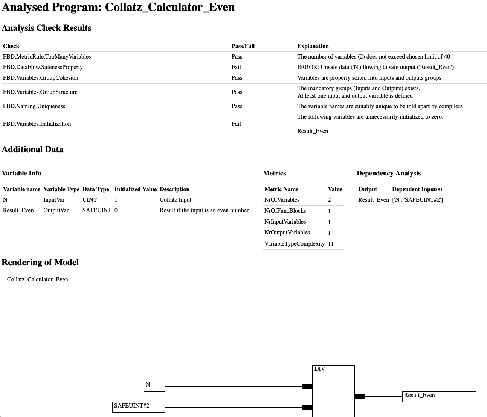
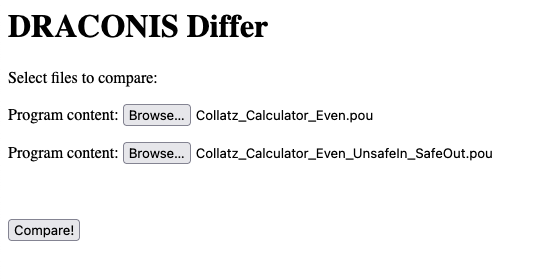
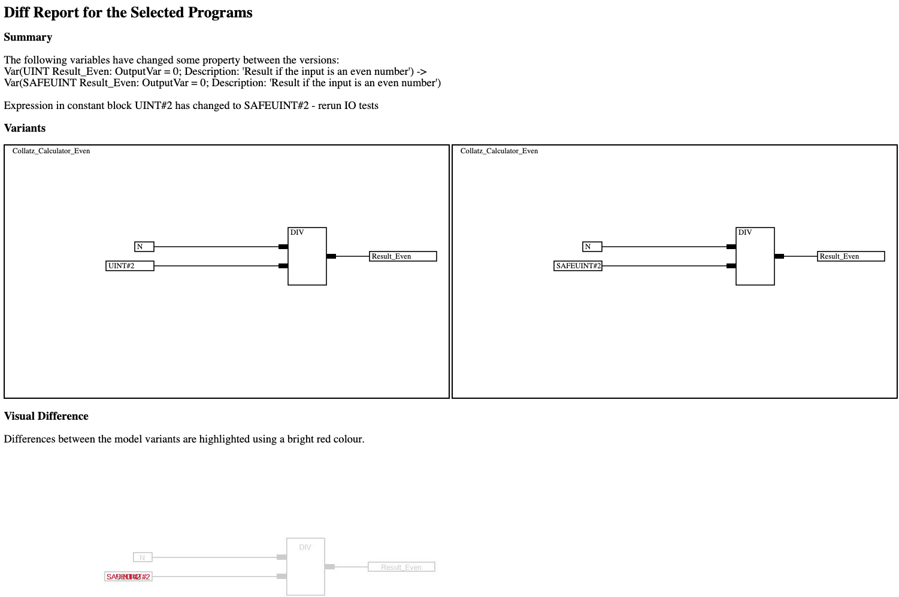

# DRACONIS
DRACONIS (**D**esign **R**ule **A**nalysis and **C**hecking **O**f **N**orms in **I**EC & **S**imulink) is a parser 
and analyser of block-based models. 

It performs different types of static analyses for the purpose of 
verifying that design rules have been followed during the implementation.

The tool supports checking of configurable rules in an interactive manner.

## Installation
From the base path, run the following commands to setup all pre-requisites for the project. 
```
pip install -r requirements_development.txt
pushd ./draconis_parser && ./regen_parser.sh && popd
```

### Additional Prerequisites
The delta report view depends on `ImageMagick` to do image comparison and processing.

See [ImageMagick](https://imagemagick.org/) for relevant installation instructions.

## Usage
*DRACONIS* supports two usage modes: Integrated in IDE or stand-alone web app.

### Web App
To start the web app, run 
```bash 
cd Web_GUI && python -m manage runserver
```
The main view of the web app allows for the analysis of a program. 
The analysed file may be selected using the UI. To run the analysis, press the button.

An example of the UI is seen below.



Once the analysis has completed, the results are shown.
Some data about the model is then presented.
Finally, a rendering of the model itself is shown, to support checking of graphical details.



In addition, DRACONIS supports diff analysis between two versions of a model.

This feature can be found under the URL path `/diff`. 
E.g., if DRACONIS is running on localhost:8000, the URL `localhost:8000/diff` shall open the diff function UI.

In the diff view, two files should be chosen.


The delta report is then generated, with a textual summary as well as a highlight of 
graphical differences.


### CLI Integration
The tool also exports reports as text, and can thus be run as a command line tool.

An example representation of this exists in [Edit Time Analysis](./draconis_parser/edit_time_analys_cli.py) 
which prints the report to console as soon as it detects a change in a POU file within the target path.

Alternatively, there is a front-end script for batch analysis in [./draconis_parser/batch_analysis_cli.py](./draconis_parser/batch_analysis_cli.py).